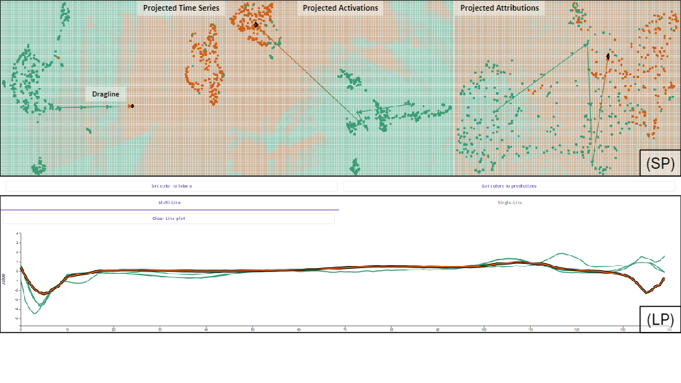

# Interactive Counterfactual Generation for Univariate Time Series

This repository hosts the official implementation of the "Interactive Counterfactual Generation for Univariate Time Series" application, as presented in our paper for the EuroVis Workshop on Visual Analytics 2024.
Our work introduces an interactive visual analytics application for generating counterfactual explanations in univariate time series data, aimed at enhancing the interpretability of deep learning models.

Demo: https://icfts.time-series-xai.dbvis.de/



## Introduction

With the increasing complexity of deep learning models in time series analysis, understanding the decision-making process behind these models becomes crucial.
Our application leverages 2D decision maps and inverse projection techniques, allowing users to interactively explore and manipulate data points to generate intuitive counterfactual explanations.
This approach aids in demystifying model predictions and fosters a deeper understanding of model behaviors.

## Key Features

-   **Interactive 2D Decision Maps**: Visualize the projections of time series data, activations, and attributions, enabling a simplified exploration of complex data.
-   **Counterfactual Explanation Generation**: Manipulate data points directly in the visualization to explore hypothetical scenarios and their outcomes.
-   **Deep Learning Insights**: Dive into model activations and attributions to uncover the rationale behind predictions.
-   **User-Centered Design**: A straightforward interface allows users to effortlessly generate and understand counterfactuals.

## Getting Started

### Prerequisites

Ensure you have the following installed:

-   Python 3.8 or newer
-   Required Python packages: `numpy`, `pandas`, `torch`, `umap-learn`, `matplotlib`
-   Docker

### Installation

Clone this repository:

```bash
git clone https://github.com/visual-xai-for-time-series/interactive-counterfactuals-for-time-series.git
cd interactive-counterfactuals-for-time-series
```

### Running the Application

To run the application, execute the following command from the root directory of the project:

```bash
docker compose up
```

or

```bash
bash start_development.bash
```

Follow the instructions in the terminal to open the application in your web browser.

## License

This project is licensed under the MIT License - see the `LICENSE` file for details.

## Citation

If you find this application useful for your research, please consider citing our paper:

```bibtex
@inproceedings{interactive-counterfactual-generation,
  title={Interactive Counterfactual Generation for Univariate Time Series},
  author={Schlegel, Udo and Keim, Daniel A.},
  booktitle={EuroVis Workshop on Visual Analytics},
  year={2024}
}
```

